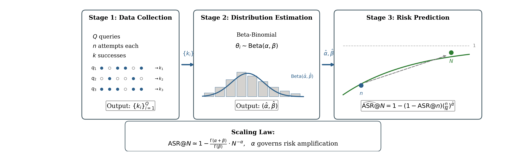

# SABER

**S**caling-**A**ware **B**est-of-N **E**stimation of **R**isk

A Python package for predicting large-scale adversarial risk in Large Language Models under Best-of-N sampling.

**Paper**: https://arxiv.org/pdf/2601.22636

[](https://www.python.org/downloads/)
[](https://opensource.org/licenses/MIT)

## Overview

Standard LLM safety evaluations use single-shot (ASR@1) metrics, but real attackers can exploit parallel sampling to repeatedly probe models. SABER provides a principled statistical framework to:

- **Predict** ASR@N at large budgets from small measurements
- **Estimate** how many attempts are needed to reach a target success rate  
- **Quantify** uncertainty in adversarial risk predictions



### Key Insight

Attack success rates scale according to a power law governed by the Beta distribution of per-query vulnerabilities:

```
ASR@N ≈ 1 - Γ(α+β)/Γ(β) · N^(-α)
```

The parameter **α** controls how fast risk amplifies with more attempts.

## Installation

```bash
pip install saber-risk
```

Or from source:

```bash
git clone https://github.com/namisan/saber
cd saber
pip install -e .
```

## Quick Start

```python
import numpy as np
from saber import SABER

# Your jailbreak evaluation data:
# k[i] = number of successful jailbreaks for query i
# n[i] = number of attempts for query i
k = np.array([3, 5, 0, 2, 8, 1, 4, 0, 6, 2])  
n = 100  # 100 attempts per query

# Fit and predict
model = SABER()
model.fit(k, n)

# Predict ASR at N=1000 attempts
result = model.predict(N=1000)
print(f"ASR@1000 = {result.asr:.2%}")

# With confidence interval
result = model.predict(N=1000, confidence=0.95)
print(f"ASR@1000 = {result.asr:.2%} [{result.ci_lower:.2%}, {result.ci_upper:.2%}]")
```

## Core Usage

```python
from saber import SABER

# 1. Collect jailbreak data
#    Run n attempts per query, count successes k
k = [...]  # successes per query
n = 100    # trials per query (or array for heterogeneous budgets)

# 2. Fit the model
model = SABER()
model.fit(k, n)

# 3. Predict ASR at target budget
asr_1000 = model.predict(N=1000).asr

# Budget estimation
result = model.budget_for_asr(target=0.95)
print(f"Need {result.budget:.0f} attempts for 95% ASR")

# Fluent API
asr = SABER().fit(k, n).predict(1000).asr
```

## Documentation

Full documentation is available in the `docs/` directory. To build:

```bash
cd docs
pip install -r requirements.txt
make html
```

- **[Quick Start](docs/quickstart.rst)** - Getting started guide
- **[API Reference](docs/api_reference.rst)** - Complete API documentation
- **[Advanced Usage](docs/advanced_usage.rst)** - Model selection, scaling curves, low-level API

## Citation

If you use SABER in your research, please cite:

```bibtex
@misc{feng2026statisticalestimationadversarialrisk,
      title={Statistical Estimation of Adversarial Risk in Large Language Models under Best-of-N Sampling}, 
      author={Mingqian Feng and Xiaodong Liu and Weiwei Yang and Chenliang Xu and Christopher White and Jianfeng Gao},
      year={2026},
      eprint={2601.22636},
      archivePrefix={arXiv},
      primaryClass={cs.AI},
      url={https://arxiv.org/abs/2601.22636}, 
}
```

## Contact

For any questions regarding the package or paper, feel free to reach out to:

- **Mingqian Feng** - mfeng7@ur.rochester.edu
- **Xiaodong Liu** - xiaodl@microsoft.com
- **Weiwei Yang** - weiweiy@microsoft.com

## License

MIT License - see [LICENSE](LICENSE) for details.
